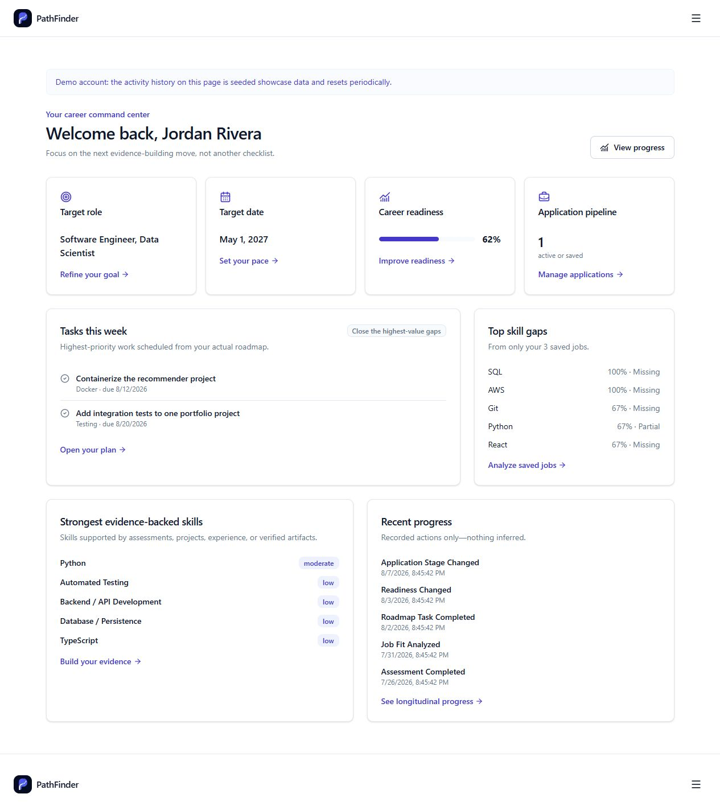
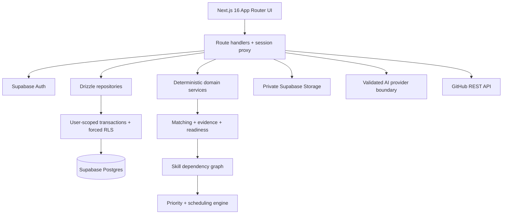

<div align="center">

# PathFinder

**Evidence-driven career readiness: explainable job fit, validated skills, and adaptive roadmaps.**

[Live demo](https://getpathfinder.app/) · [Architecture](docs/architecture.md) · [Run locally](#local-setup)

[](https://github.com/mojaffri/PathFinder/actions/workflows/ci.yml)
[](https://nextjs.org)
[](https://www.typescriptlang.org)
[](https://supabase.com)

</div>



## What PathFinder is

PathFinder is a full-stack career-readiness platform for students and early-career candidates. It combines deterministic career and job matching, structured job-description extraction, skill evidence from profiles and GitHub, assessments, adaptive roadmaps, saved-job insights, and application tracking.

The central constraint is simple: AI may interpret unstructured text or grade subjective responses, but it does not own numerical ranking, evidence confidence, dependency ordering, or scheduling.

## Problem

Career tools often stop at generic advice or keyword overlap. Candidates still cannot answer three practical questions:

1. Why does this role fit me?
2. What evidence supports each claimed skill?
3. What should I do next, given my time and target date?

PathFinder turns those questions into inspectable data and deterministic domain decisions instead of an opaque chat response.

## Core workflow

```text
Profile → Resume → Saved job → Requirement-level fit → Evidence-backed gaps
        → Adaptive roadmap → Assessments → Application and progress history
```

For a zero-setup product tour, open the [live site](https://getpathfinder.app/) and choose **Try the demo**. Seeded data is visibly labeled as demo data.

## What makes it technically interesting

- **Deterministic matching.** Career matching, job-fit scoring, readiness, evidence confidence, roadmap priority, and scheduling are pure or database-backed domain logic—not LLM rankings.
- **Structured AI boundaries.** Resume/job extraction and roadmap narrative use a server-only provider interface; current assessments are deterministic fixed-choice items. Every structured AI response is validated with Zod, and scanned PDFs can be read as visual documents through Vercel AI Gateway.
- **Evidence instead of keywords.** Claimed, assessed, demonstrated, and professional signals carry different weights. GitHub analysis uses reproducible file-tree and manifest detectors; popularity metrics never increase skill confidence.
- **Skill dependency graph.** SkillForge separates learning completion from mastery, tracks multiple dimensions, and walks prerequisite relationships to diagnose root-cause gaps.
- **Deterministic scheduling.** Roadmap tasks are prioritized from gap severity, saved-job frequency, evidence confidence, and prerequisites, then scheduled against weekly availability and a target date.
- **Real persistence and isolation.** Supabase Auth and Postgres back 34 application tables. Drizzle repositories scope every query to a verified user, with forced Row Level Security as a second enforcement layer.
- **Auditable progress.** Structured activity events record meaningful changes such as assessments, job analysis, readiness, roadmap completion, and application-stage transitions. Analytics never invent missing history.
- **Production verification.** GitHub Actions runs lint, strict type checking, unit tests, embedded-Postgres integration tests, a production build, and desktop/mobile Playwright smoke tests without paid AI calls.

## Architecture



See [docs/architecture.md](docs/architecture.md) for the component boundaries and [docs/database.md](docs/database.md#er-diagram) for the database ER diagram.

## Why this is not an LLM wrapper

- The LLM converts unstructured resumes and job descriptions into validated records.
- Requirement weights and fit scores are computed independently in TypeScript.
- Evidence links back to profile records, assessment attempts, projects, or deterministic GitHub signals.
- Roadmap dependencies, priorities, feasibility, and dates are deterministic.
- AI supplies interpretation and feedback; Postgres remains the source of truth and domain engines remain the decision system.
- Missing keys, timeouts, malformed output, and provider failures have tested fallback or explicit error behavior.

## Product surfaces

| Surface | What it demonstrates |
|---|---|
| Discover | Weighted, explainable matching across 46 curated careers and 9 categories |
| Resume & profile | PDF/DOCX validation, AI-assisted entity grouping, scanned-PDF vision, extraction review, version history, private original-file storage |
| Job Fit | Structured required/preferred requirements and requirement-by-requirement deterministic fit |
| Saved-job insights | Skill frequency and evidence coverage based only on the user's saved jobs |
| Projects | Public GitHub analysis, deterministic engineering signals, evidence linkage |
| SkillForge | Diagnostics, graded attempts, multidimensional mastery, prerequisite diagnosis |
| Adaptive roadmap | Gap-derived tasks, dependencies, priorities, capacity-aware dates, completion history |
| Dashboard & analytics | Persisted readiness, evidence, job, application, roadmap, and activity summaries |
| Applications | A focused nine-stage pipeline with dates, notes, fit, and application-time gap snapshots |

## Tech stack

- Next.js 16 App Router, React 19, strict TypeScript, Tailwind CSS 4
- Supabase Auth, Postgres, and private Storage
- Drizzle ORM and `postgres.js`
- Anthropic SDK behind a provider-neutral, Zod-validated server boundary
- GitHub REST API with deterministic repository-signal detectors
- Vitest, PGlite integration tests, Playwright, axe-core, ESLint, GitHub Actions
- Vercel deployment, Web Analytics, and structured server logs

## Local setup

Requirements: Node.js 22+, npm, and a Supabase project for authenticated/persisted flows.

```bash
git clone https://github.com/mojaffri/PathFinder.git
cd PathFinder
npm ci
cp .env.example .env.local
```

Configure the variables described in [.env.example](.env.example), then initialize the database:

```bash
npm run db:migrate
npm run db:seed:reference
npm run db:seed:demo   # optional recruiter demo account
npm run dev
```

The app still builds without external credentials. Database-backed pages show configured error/empty states, and AI-backed features use deterministic fallbacks where the product can do so safely.

Detailed setup:

- [Database, migrations, and seeding](docs/database.md)
- [Authentication, OAuth, and security](docs/security.md)
- [GitHub integration](docs/github-integration.md)
- [AI system](docs/ai-system.md)

### Supabase and OAuth redirects

Add these Supabase Auth redirect URLs:

```text
http://localhost:3000/auth/callback
https://getpathfinder.app/auth/callback
```

Enable Google and/or GitHub in Supabase Auth, configure the provider credentials there, and set the matching public feature flag. GitHub project analysis can also use a server-side public-data token and a separate encryption key; it never requires private-repository scope.

Email/password accounts include confirmation, magic-link sign-in, and password recovery through the same callback route. Before production traffic, configure a custom SMTP sender under Supabase Authentication settings; Supabase's default sender is intended for testing and is rate limited. Keep the production Site URL and callback URL on Supabase's redirect allowlist.

### Production deployment

Vercel needs the production values documented in [.env.example](.env.example). Use a Supabase transaction-pooler `DATABASE_URL` for serverless runtime traffic. Structured AI uses Vercel AI Gateway's automatic OIDC token on Vercel, so no long-lived model key is required there; local development can use `ANTHROPIC_API_KEY` or `AI_GATEWAY_API_KEY`. Run migrations and reference seeding before exposing authenticated routes; seed demo data only when the shared demo is intended to be public.

No secrets belong in Git, client-side variables, screenshots, or logs.

## Quality gate

```bash
npm run lint
npm run typecheck
npm run test:unit
npm run test:integration
npm run build
npm run test:e2e
```

CI uses an embedded Postgres instance for repository and RLS integration tests and does not call a paid AI provider. Set `PLAYWRIGHT_BASE_URL` and `E2E_DEMO=1` to include configured live-demo journeys.

## Documentation map

- [Architecture](docs/architecture.md)
- [Database and ER diagram](docs/database.md)
- [Scoring](docs/scoring.md)
- [Evidence model](docs/evidence-model.md)
- [GitHub integration](docs/github-integration.md)
- [Roadmap engine](docs/roadmap-engine.md)
- [Assessments](docs/assessments.md)
- [AI system](docs/ai-system.md)
- [Security](docs/security.md)
- [Recruiter evaluation guide](docs/recruiter-guide.md)
- [Architecture decisions](docs/adr/README.md)
- [Verified project state](docs/project-state.md)

## Repository metadata

Recommended GitHub description:

> Evidence-driven career readiness with deterministic job matching, validated AI extraction, GitHub skill evidence, and adaptive roadmaps.

Recommended topics: `nextjs`, `typescript`, `postgresql`, `supabase`, `career-development`, `recommendation-system`, `llm`, `github-api`, `full-stack`, `ai-engineering`.

## License

[MIT](LICENSE)
