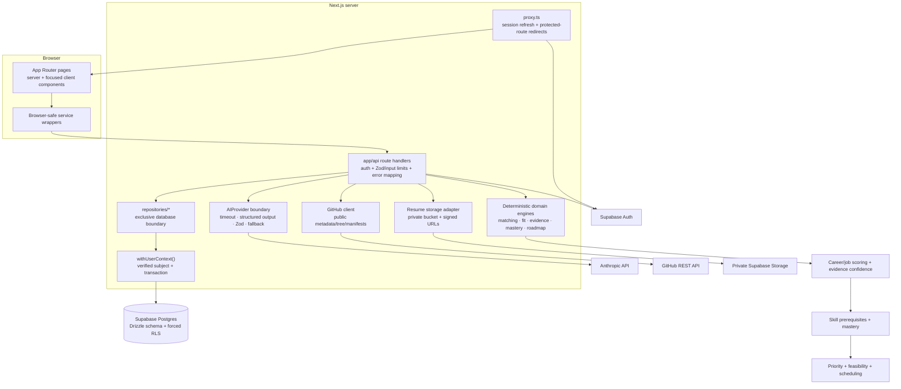

# Architecture

PathFinder is a Next.js 16 application organized around a strict boundary: unstructured interpretation may use AI, while ranking, evidence, readiness, dependencies, and scheduling remain deterministic.

## System diagram

## Request and trust boundaries

1. `proxy.ts` refreshes Supabase cookies and redirects protected page requests before rendering.
2. Every protected route verifies the session through `getServerUser()`; client-supplied user IDs are never authorization inputs.
3. Routes validate user or external data, call deterministic domain services, and delegate persistence to repositories.
4. Repositories run inside `withUserContext()`, which places the verified Supabase subject in a transaction-local Postgres claim.
5. Forced Row Level Security blocks cross-user access even if a repository query omits an ownership predicate.
6. External providers receive the minimum necessary data. Sensitive document bodies and tokens are excluded from logs.

## Domain boundaries

| Boundary | Responsibility | Representative code |
|---|---|---|
| Career matching | Weighted, explainable matching over curated careers | `lib/matching/` |
| Gap analysis | Stage-aware, hour-costed readiness gaps | `lib/gap-analysis/` |
| Job analysis | Validated extraction followed by deterministic requirement scoring | `lib/jobs/` |
| Evidence | Normalize claimed, assessed, demonstrated, and professional evidence | `lib/evidence/` |
| GitHub | Reproducible file-tree/manifest detectors and skill mapping | `lib/github/` |
| SkillForge | Mastery dimensions, recency/confidence, prerequisite diagnosis | `lib/skillforge/` |
| Adaptive roadmap | Task generation, priority, dependencies, feasibility, scheduling | `lib/roadmap/` |
| Analytics | Aggregate only persisted snapshots and structured events | `repositories/analytics-repository.ts` |

## Data architecture

Supabase owns identity (`auth.users`) and sessions. Drizzle owns 34 application tables and all migrations. Postgres is accessed directly rather than through PostgREST, so `withUserContext()` and `FORCE ROW LEVEL SECURITY` are both essential.

See [database.md](database.md#er-diagram) for the ER diagram, table groups, migrations, and index strategy.

## AI architecture

`lib/ai/` exposes a provider-neutral interface. The Anthropic adapter is server-only. Structured calls use bounded output, timeouts, a schema/tool contract, Zod validation, and one malformed-output retry.

AI is used for resume and job extraction, selected narrative generation, GitHub summary text, and subjective assessment grading. It is not used for career ranking, fit weights, evidence confidence, mastery calculation, roadmap priority, or scheduling. See [ai-system.md](ai-system.md) and [scoring.md](scoring.md).

## Reliability and observability

- Expected failures become typed API responses and actionable UI states.
- Database, route, storage, GitHub, and AI failures produce structured server logs without document bodies or tokens.
- Vercel Analytics measures aggregate page usage.
- Activity events support product analytics and auditability; they are not a full access log.
- CI verifies lint, types, unit logic, repository/RLS behavior, production compilation, and desktop/mobile smoke journeys.

## Intentional constraints

- The demo is a shared, seeded account—not a per-visitor sandbox.
- GitHub detectors inspect public repository structure and manifests; they do not execute or deeply parse source code.
- The platform is decision support, not a guarantee of hiring outcomes or a substitute for official licensing/program requirements.
- AI fallback quality is intentionally more conservative than provider-backed narrative quality.
