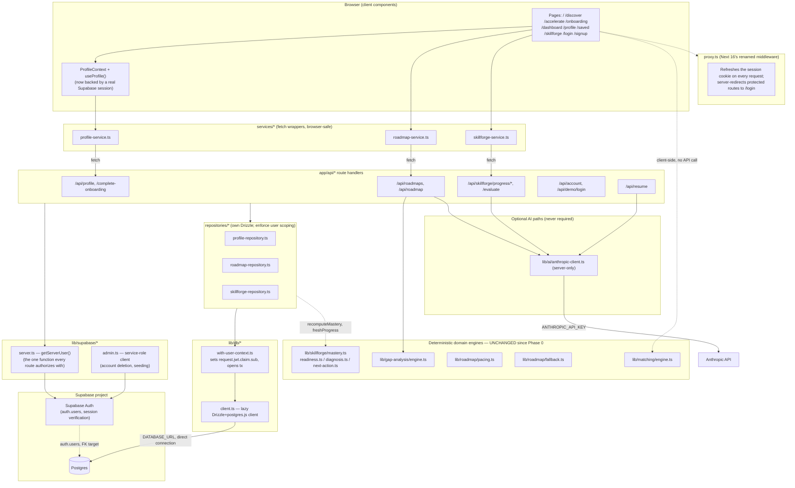
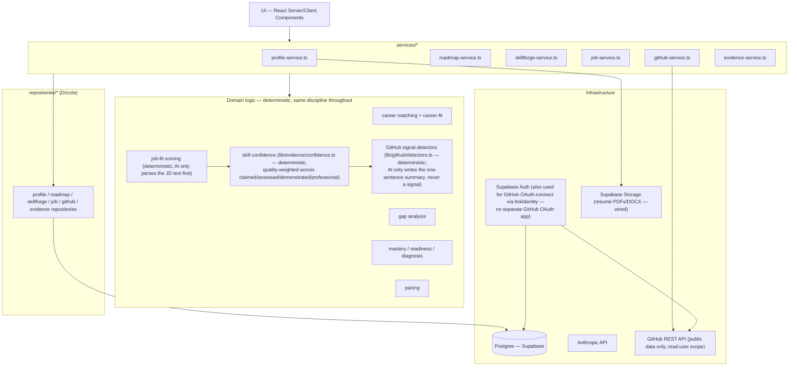

# PathFinder — Architecture

This file holds the diagrams and schema design referenced from [`CLAUDE.md`](../CLAUDE.md) and [`project-state.md`](./project-state.md). It is a durable reference (updated when the architecture actually changes), not a changelog — for "what's true right now, what's broken, what's next," see `project-state.md`. For the full schema and migration workflow, see [`database.md`](./database.md); for the auth/RLS model, see [`security.md`](./security.md).

---

## 1. Current architecture (Phase 1 complete)

Real persistence and auth exist now — this diagram supersedes the pre-Phase-1 "everything in localStorage" version.

**Key characteristics:**
- **Real auth, real persistence.** Supabase Auth (email/password, magic link, Google/GitHub OAuth) + Postgres via Drizzle, replacing the old single-browser `localStorage` + mock-session design entirely.
- **Two-layer authorization**, not one: application-layer scoping (repositories take a server-verified `userId`) plus `FORCE ROW LEVEL SECURITY` as a backstop — see `security.md` for exactly why both are needed given the app connects directly to Postgres rather than through Supabase's PostgREST layer.
- **The domain engines did not change.** Career matching, gap analysis, mastery scoring, and pacing math are the same pure functions as before this phase — only the persistence and auth boundary around them changed. This was a deliberate constraint, not an accident: `CLAUDE.md` explicitly protects these from casual rewrites.
- **Graceful degradation extends to the database now.** `getDb()` never throws at import time; a missing `DATABASE_URL` produces a clear 503 from API routes (`DatabaseNotConfiguredError`) rather than crashing the build or the server — the same convention `getAnthropicClient()` established for the optional AI key.
- **`proxy.ts`, not `middleware.ts`.** Next.js 16 renamed the file convention (see `node_modules/next/dist/docs/01-app/03-api-reference/03-file-conventions/proxy.md`) — this repo already uses the new name; don't reintroduce a `middleware.ts`.

---

## 2. Phase 2 architecture (implemented — job analysis, resume upgrade, evidence-backed skills, GitHub integration)

Everything in this diagram is real now, built across two sessions (see `docs/project-state.md`'s "Last Updated" history for the session-by-session breakdown). Resume Storage is wired (session 2); job analysis is wired (session 2); evidence/confidence and GitHub integration are wired (session 3).

**What Phase 2 added, following the pattern Phase 1 established:** `job_descriptions`/`job_requirements`/`job_matches` (job analysis, session 2); `github_connections`/`github_repos`/`skill_evidence_records` (evidence + GitHub, session 3) — all schema + RLS + repository/service/API-route layers, fully implemented. AI is used only to parse unstructured text (a job posting, a repo's description) or write a narrative sentence over already-computed facts — every score (job fit, career fit, skill confidence) is a deterministic function, never an LLM call in the scoring path itself. Full detail: `docs/evidence-model.md`, `docs/github-integration.md`.

---

## 3. ER diagram and schema

Moved to [`database.md`](./database.md) — that file is now the single source of truth for the schema (30 tables as of session 3), design rationale, and the ER diagram, since it needs to stay tightly coupled to `lib/db/schema/*.ts` and the migration files. Keeping it in one place avoids this file and `database.md` silently drifting apart, which is exactly the kind of staleness this project's audits have caught before (see `project-state.md`'s history).

---

## 4. Database & auth decision (implemented)

**Supabase (Postgres + Auth) + Drizzle ORM** — see [`database.md`](./database.md#why-supabase--drizzle) for the comparison against Neon+Prisma and the reasoning, and [`security.md`](./security.md) for how auth/RLS is actually wired. This was a recommendation in the previous version of this document; it is now implemented, not proposed.
