# PathFinder — Database

Real persistence, as of Phase 1: **Supabase Postgres**, schema/migrations managed by **Drizzle ORM**, with **Row Level Security** as a defense-in-depth backstop on top of application-layer authorization. This file is the durable reference for the schema, the migration workflow, and how the pieces fit together. For current status (is this deployed, is it seeded, etc.), see [`project-state.md`](./project-state.md).

---

## Why Supabase + Drizzle

Decided and implemented this phase (previously a recommendation in an earlier version of this file):

- **Supabase** bundles Postgres, Auth, and Storage in one project — the app needs all three (accounts, relational data, eventually resume files), and `@supabase/ssr` is a well-trodden path for Next.js App Router session handling.
- **Drizzle** (not the Supabase JS client) owns the schema and migrations, so the data-access layer stays strict-TypeScript and provider-agnostic — `repositories/*` would survive a future move off Supabase's Postgres with no `services/*` or UI changes, only a `lib/db/client.ts` rewrite.
- The two integrate at a specific, deliberate seam: **Supabase Auth** issues and verifies sessions; **Drizzle, via a direct Postgres connection**, does all reads/writes. The app never goes through Supabase's PostgREST API. See "How RLS actually gets enforced" below — this choice has a real consequence that's easy to get wrong.

## Local setup

1. Create a free project at [supabase.com](https://supabase.com).
2. Copy `.env.example` to `.env.local` and fill in:
   - `NEXT_PUBLIC_SUPABASE_URL`, `NEXT_PUBLIC_SUPABASE_ANON_KEY` — Project Settings → API.
   - `SUPABASE_SERVICE_ROLE_KEY` — same page, service_role key. Server-only; never expose to the client.
   - `DATABASE_URL` — Project Settings → Database → Connection string (direct connection for local scripts; use the transaction pooler connection string if deploying to a serverless platform like Vercel).
3. Run the migrations:
   ```bash
   npm run db:migrate
   ```
4. Seed the reference data (careers + SkillForge modules — required before anyone can save a career match or make SkillForge progress, since those tables have FK references to `careers`/`skill_modules`):
   ```bash
   npm run db:seed:reference
   ```
5. (Optional) Seed the demo account — see [`security.md`](./security.md#demo-mode) and `.env.example`'s `DEMO_USER_EMAIL`/`DEMO_USER_PASSWORD`:
   ```bash
   npm run db:seed:demo
   ```
6. `npm run dev`. Without any of the above configured, the app still builds and runs — every DB-backed page/route degrades to a clear "not configured" or "sign in" state (same convention as the optional `ANTHROPIC_API_KEY`), it just has nothing to show.

### Changing the schema

Edit the relevant file under `lib/db/schema/`, then:

```bash
npm run db:generate   # drizzle-kit generate — writes a new SQL file to drizzle/migrations/
npm run db:migrate    # applies every unapplied migration in filename order
```

`scripts/migrate.ts` is a small hand-rolled runner, not drizzle-kit's own migrator — it tracks applied migrations in a `_migrations` table and runs every `.sql` file in `drizzle/migrations/` in filename order. This is deliberate: the RLS policy file (`0001_rls_policies.sql`) is hand-written SQL, not something `drizzle-kit generate` produces, and it needs to run in the same linear sequence as the generated schema migrations.

**Important:** `drizzle-kit generate` will happily emit `CREATE TABLE "auth"."users" (...)` because `lib/db/schema/auth.ts` declares a stub reference to it (see below). **Never let that statement reach a real Supabase database** — Supabase already owns and manages `auth.users`. Every migration in this repo has had that statement manually stripped and replaced with a comment; do the same if you regenerate a migration that includes it.

## Schema overview

36 tables. Full definitions live in `lib/db/schema/*.ts`; migrations now run through `0010`, adding the Phase-4 application expansion, indexes, and persistent API throttling.

| Group | Tables |
|---|---|
| Identity | `profiles` (references Supabase's own `auth.users`, not duplicated) |
| Profile detail | `education`, `experience`, `projects`, `awards`, `certifications`, `career_goals`, `skills`, `resumes` |
| Career matching | `careers` (seeded reference), `career_matches` |
| Roadmaps (narrative, Phase 2) | `roadmaps`, `gap_items`, `roadmap_phases`, `roadmap_tasks` |
| Adaptive roadmap engine (Phase 3) | `adaptive_roadmaps`, `adaptive_roadmap_phases`, `adaptive_roadmap_tasks`, `adaptive_roadmap_change_events`, `adaptive_roadmap_completed_history` |
| SkillForge | `skill_modules` (seeded reference), `skill_progress`, `assessments`, `assessment_attempts`, `skill_evidence` |
| Job analysis (Phase 2, implemented) | `job_descriptions`, `job_requirements`, `job_matches` |
| Evidence-backed skills & GitHub (Phase 2) | `skill_evidence_records` (manual evidence only — see `docs/evidence-model.md`), `github_connections`, `github_repos` |
| Application tracking (Phase 4) | `applications` |
| Observability and abuse protection | `activity_events`, `api_usage_windows` |

### Migration history

`scripts/migrate.ts` applies every `.sql` file in `drizzle/migrations/` in filename order (see "Local setup" above) — the full sequence as of this phase:

1. `0000_init_schema.sql` — the original 25-table schema (Phase 1).
2. `0001_rls_policies.sql` — hand-written RLS policies for that schema.
3. `0002_job_analysis_and_resume_upgrade.sql` — additive: new `job_requirements` table, new columns on `resumes` (`file_name`, `file_type`, `file_size_bytes`, `extraction_confidence`, `is_active` + a partial unique index enforcing one active resume per profile) and `job_descriptions`/`job_matches` (structured top-level fields, component scores, requirement matches).
4. `0003_drop_legacy_job_columns.sql` — drops `job_descriptions.parsed_requirements` and `job_matches.fit_score`/`gap_breakdown`, the unused Phase-1 placeholder columns those tables were schema-only with (split into its own migration from `0002` specifically to avoid `drizzle-kit generate`'s interactive rename-detection prompt, which can't run in a non-TTY environment — see that migration's git history if this needs to happen again: add columns in one `generate` pass, drop old ones in a second).
5. `0004_job_requirements_rls.sql` — RLS policy for the new `job_requirements` table (owned transitively through `job_description_id`, same pattern as `gap_items`).
6. `0005_evidence_and_github_schema.sql` — new tables: `github_connections`, `github_repos`, `skill_evidence_records`. Also added `projects.github_url` (was schema-only unused since Phase 1; now wired through `types/records.ts#ProjectRecord` and `repositories/profile-repository.ts` for real).
7. `0006_evidence_and_github_rls.sql` — RLS policies for the three new tables, same profile-owned pattern as `0001`.
8. `0007_adaptive_roadmap_schema.sql` — new tables for the Phase 3 adaptive roadmap engine: `adaptive_roadmaps` (one per profile, `UNIQUE` on `profile_id`), `adaptive_roadmap_phases`, `adaptive_roadmap_tasks`, `adaptive_roadmap_change_events`, `adaptive_roadmap_completed_history`. Hand-written (not `drizzle-kit generate` output) to match this repo's established column-naming/check-constraint conventions exactly, same approach as every prior hand-authored migration in this history.
9. `0008_adaptive_roadmap_rls.sql` — RLS policies for the five new tables: `adaptive_roadmaps` is owned directly by `profile_id`; the other four are owned transitively through it, same join-based pattern as `gap_items`/`roadmap_phases`/`roadmap_tasks` in `0001`.
10. `0009_product_completeness.sql` — expands `applications` with posting/source/fit/interview-date/gap-snapshot fields and the nine-stage constraint; adds application/activity/job query indexes.
11. `0010_api_rate_limits.sql` — creates RLS-protected `api_usage_windows`, keyed per profile and time window for atomic throttling across serverless instances.

**Important for anyone regenerating migrations:** `tests/integration/db.ts` lists migration files by name (not by directory scan), so a new migration file must be added there too or the integration/RLS test suite will fail against a schema that's missing it.

### Design notes

- **`profiles`, not `users`.** Supabase's `auth.users` already is the users table — `profiles.user_id` (unique) references it. There is no separate app-level `users` table; duplicating identity data would just create a sync problem. `lib/db/schema/auth.ts` declares a minimal stub of `auth.users` purely so Drizzle can type the FK — it is never created or altered by any migration here.
- **`careers` and `skill_modules` are seeded reference tables, not user data.** Each row is a 1:1 JSONB copy of an entry in `data/careers.ts` / `data/skillforge-modules.ts` (`scripts/seed-reference-data.ts`), not normalized into columns — there's no query need for their internals yet, and JSONB means re-seeding after editing the source data is lossless. `assessments` is a thin queryable pointer (one row per `(skill_id, stage)`) seeded alongside `skill_modules`, so `assessment_attempts` can reference a real row instead of a loose `(skill_id, stage)` pair.
- **Every date-like resume/profile field (`education.start_date`, `experience.end_date`, `projects.date`, `awards.date`, `certifications.date`) is `text`, not SQL `date`.** This was a real bug caught by `tests/integration/profile-repository.test.ts`: résumés and this app's own forms routinely produce partial dates ("2022-08", "2022", "Aug 2022"), which Postgres's `date` type rejects outright. `EducationRecord.startDate` etc. are `string | null` in `types/records.ts` for exactly this reason — the column types now match. `profiles.target_date` and `applications.applied_at` **are** real `date` columns, since those are new fields fed exclusively by an HTML `<input type="date">`, always a full `YYYY-MM-DD`.
- **Narrative roadmap content stays JSONB** (`roadmaps.executive_summary` is `text`, but `competitive_advantages`, `certification_guidance`, `ai_advantage`, `target_resume_benchmark`, etc. are JSONB) — AI-or-fallback-generated prose with no query need of its own. `gap_items`, `roadmap_phases`, and `roadmap_tasks` **are** normalized, because top-move/gap queries across roadmaps are a real, anticipated need.
- **`roadmaps.gap_analysis_summary` is distinct from `roadmaps.current_profile_assessment`** — the former is `GapAnalysis.currentStateSummary` (a deterministic bullet list from `lib/gap-analysis/engine.ts`), the latter is the AI/fallback-generated narrative paragraph. Easy to conflate; they are genuinely two different fields with two different origins.
- **`career_goals` (the table) holds target careers, not the free-text career-goals paragraph.** Confusing overlap in naming: `profiles.career_goals` (a `text` column) is `StudentProfile.careerGoals` (a free-text narrative the student writes); the separate `career_goals` **table** normalizes `StudentProfile.targetCareers` (the list of target careers). Both names come from the domain model as it already existed — noted here so a future session doesn't assume they're the same thing.
- **`skills` (the table) is the profile's flat, free-text skill tags** (`StudentProfile.currentSkills`), sourced from manual entry or resume extraction. It is deliberately unrelated to SkillForge's `skill_progress`/`skill_modules` (curated-module mastery tracking) — conflating "skills I say I have" with "skills SkillForge is actively developing" would break the career-agnostic separation `CLAUDE.md` requires between the two systems.
- **`resumes` now supports real version history and real file storage.** Every upload (PDF or DOCX) becomes its own row rather than overwriting the last one; `is_active` (with a partial unique index enforcing exactly one active resume per profile) marks which version currently backs the profile / is used as job-fit evidence. `storage_path` is wired up to Supabase Storage (`lib/supabase/storage.ts`, private `resumes` bucket, auto-created on first upload) — the original file is genuinely persisted now, not just the extracted text; storage failures degrade gracefully (the extraction result still returns) rather than blocking the upload.
- **`job_descriptions`/`job_requirements`/`job_matches` are implemented this phase** (Phase 2's flagship job-analysis workflow — see `docs/implementation-plan.md`). `job_requirements` normalizes each individual required/preferred skill/tool/experience/education item into its own editable row (so a student can correct one misextracted requirement without re-parsing the whole posting); `job_matches` stores a point-in-time snapshot of a deterministic fit-analysis run (`lib/jobs/fit-scoring.ts`) rather than only recomputing on read, specifically so a student can compare fit before/after building evidence for a gap.
- **`applications` is intentionally compact but fully implemented.** `gaps_snapshot` and `fit_score` capture application-time state instead of silently changing as the profile improves; interview dates are full ISO date strings and status is one of the nine product stages.

### ER diagram

```mermaid
erDiagram
    profiles ||--o{ education : has
    profiles ||--o{ experience : has
    profiles ||--o{ projects : has
    profiles ||--o{ awards : has
    profiles ||--o{ certifications : has
    profiles ||--o{ career_goals : has
    profiles ||--o{ skills : has
    profiles ||--o{ resumes : uploads
    profiles ||--o{ career_matches : receives
    profiles ||--o{ roadmaps : owns
    profiles ||--o{ skill_progress : tracks
    profiles ||--o{ applications : tracks
    profiles ||--o{ job_descriptions : saves
    profiles ||--o{ activity_events : generates
    profiles ||--o{ github_connections : "at most one"
    profiles ||--o{ github_repos : analyzes
    profiles ||--o{ skill_evidence_records : "manually adds"

    careers ||--o{ career_matches : "matched as"
    roadmaps ||--o{ gap_items : contains
    roadmaps ||--o{ roadmap_phases : contains
    roadmap_phases ||--o{ roadmap_tasks : contains

    skill_modules ||--o{ skill_progress : "progress against"
    skill_modules ||--o{ assessments : defines
    skill_progress ||--o{ assessment_attempts : has
    assessments ||--o{ assessment_attempts : graded_by
    skill_progress ||--o{ skill_evidence : has

    job_descriptions ||--o{ job_requirements : "broken into"
    job_descriptions ||--o{ job_matches : "scored against"
    job_descriptions ||--o{ applications : "attached to"
    resumes ||--o{ job_matches : "evidence for"

    github_connections ||--o{ github_repos : "analyzed via (nullable)"
    projects ||--o{ github_repos : "linked_project_id (nullable, repo-side pointer)"

    profiles {
        uuid id PK
        uuid user_id FK "references auth.users, unique"
        text name
        int age
        text education_stage
        numeric gpa_raw
        text target_industry
        text career_goals "free-text narrative"
        text[] interests
        text[] preferred_locations
        text employment_preference
        date target_date
        boolean is_demo
        timestamptz onboarding_completed_at
    }
    career_goals {
        uuid id PK
        uuid profile_id FK
        text career_id "best-effort FK to careers.id"
        text title
        int rank
    }
    skills {
        uuid id PK
        uuid profile_id FK
        text name
        text source "manual | resume"
    }
    careers {
        text id PK
        text title
        text category
        jsonb data "full curated Career record"
    }
    roadmaps {
        uuid id PK
        uuid profile_id FK
        text[] target_careers
        text source "discover | accelerate"
        text generation_source "ai | fallback"
        text executive_summary
        text[] gap_analysis_summary
        jsonb competitive_advantages
    }
    skill_modules {
        text id PK
        text category
        text priority
        jsonb data "full curated SkillModule"
    }
    skill_progress {
        uuid id PK
        uuid profile_id FK
        text skill_id FK
        text level
        jsonb dimensions
        jsonb confidence
        text evidence_strength
    }
    assessments {
        uuid id PK
        text skill_id FK
        text stage "diagnostic | assessment"
    }
    assessment_attempts {
        uuid id PK
        uuid skill_progress_id FK
        uuid assessment_id FK
        jsonb responses
        jsonb evaluation "nullable — ungraded"
    }
    resumes {
        uuid id PK
        uuid profile_id FK
        text storage_path "Supabase Storage, private bucket"
        text file_name
        text file_type "pdf | docx"
        boolean is_active "one per profile, partial unique index"
        text extraction_method "ai | heuristic"
    }
    job_descriptions {
        uuid id PK
        uuid profile_id FK
        text raw_text
        text title
        text company
        int min_experience_years
        text education_requirement
        text[] responsibilities
        text[] keywords
    }
    job_requirements {
        uuid id PK
        uuid job_description_id FK
        text category "required | preferred"
        text kind "skill | tool | experience | education"
        text label
        int min_years
        text source "ai | manual"
    }
    job_matches {
        uuid id PK
        uuid profile_id FK
        uuid job_description_id FK
        uuid resume_id FK "nullable — which resume's evidence was used"
        int overall_fit_score
        jsonb component_scores
        jsonb requirement_matches
        jsonb top_recommendations
    }
    github_connections {
        uuid id PK
        uuid profile_id FK "unique — at most one per profile"
        text github_username
        text access_token_encrypted "AES-256-GCM, never plaintext"
        text scope "read:user only"
    }
    github_repos {
        uuid id PK
        uuid profile_id FK
        uuid connection_id FK "nullable — public analysis has no connection"
        text full_name
        text html_url
        jsonb languages
        jsonb detected_signals "DetectedSignal[] — testing/cicd/docker/database/backendApi/deployment/readme"
        jsonb skill_evidence "SkillSignal[] — deterministic, never star/fork/commit-derived"
        text summary "recruiter-style, AI-polished w/ deterministic fallback"
        int stars "metadata only — never a quality signal"
        uuid linked_project_id FK "nullable — repo-side pointer, see CLAUDE.md Domain boundaries"
    }
    skill_evidence_records {
        uuid id PK
        uuid profile_id FK
        text skill_name
        text source_type "resume|experience|project|github_repo|coursework|assessment|certification|publication"
        text evidence_strength "weak | moderate | strong"
        text verification_status "unverified | self-reported | verified"
        text explanation
    }
```



## Repository layer

`repositories/*.ts` is the only code that imports `lib/db/schema` and `lib/db/with-user-context.ts`. Each function takes a server-verified `userId` (never a client-supplied one) and returns/accepts the same domain types (`StudentProfile`, `SavedRoadmap`, `SkillProgress`, …) the rest of the app already uses — `services/*` (called from client components) are thin `fetch()` wrappers over `app/api/*` routes, which call repositories directly.

```
UI (client components)
  → services/*.ts        (fetch wrappers, browser-safe)
    → app/api/*/route.ts  (verifies the session, calls a repository)
      → repositories/*.ts (owns Drizzle, enforces user scoping)
        → lib/db/with-user-context.ts (sets request.jwt.claim.sub, opens the tx)
          → Postgres (Supabase)
```

`updateProfile`/`saveRoadmap` are **full-replace**, not diffed: every write deletes and reinserts a profile's child collections (education, experience, etc.) or a roadmap's gaps/phases/tasks from the submitted arrays, in one transaction — this mirrors the exact semantics the old `localStorage` version had (`writeJSON` overwrote the whole object) and is simple and correct at this app's per-user data volume. Revisit only if per-record history/versioning is ever needed.

See [`security.md`](./security.md) for how `withUserContext` and Row Level Security work together — that's the part of this design most likely to be misunderstood if copied without reading it.
